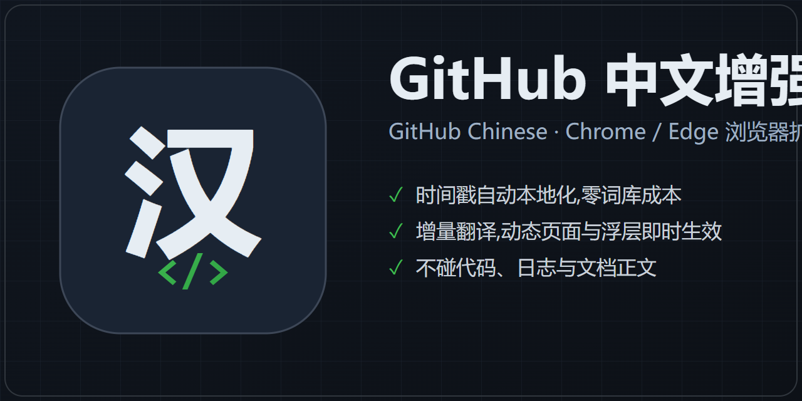

<p align="center">
  
</p>

# GitHub 中文增强 GitHub Chinese

一个开源的 GitHub 界面汉化浏览器扩展（Chrome / Edge，Manifest V3）：把 GitHub 的导航、按钮、设置页、Issue、Pull Request、Actions 等界面文案翻译成程序员习惯的中文，同时刻意保留 PR、Issue、Fork、Star、Runner、Token、Webhook 等术语，并且**绝不翻译代码、日志和文档正文**。

> 词库维护参考了社区项目 [maboloshi/github-chinese](https://github.com/maboloshi/github-chinese)（32k★，油猴脚本）的页面分类思路，在其协助下完成了逐页覆盖度比对；该项目源自 [52cik/github-hans](https://github.com/52cik/github-hans)，一并致谢。

## ✨ 功能特性

### 界面汉化

- 覆盖顶部导航、仓库页、Issue、Pull Request、Review、Release、讨论区、Projects 等开发全流程
- 覆盖 Settings 大量菜单与说明：权限、安全、Actions、Pages、Webhook、Secrets、Variables、Danger Zone 等
- 覆盖 Actions 工作流页：运行记录、Job、Step、Runner、缓存、产物、部署审批
- 按钮提示、输入框 `placeholder`、`aria-label`、确认弹窗一并翻译
- 词库规模：**3300+ 精确词条 + 210 条正则规则**，持续补充中

### 时间戳自动本地化

`3 days ago`、`about 1 hour ago`、`last month` 等相对时间直接显示为中文——借助 GitHub 自带时间组件的多语言渲染能力，零词库成本，且随时间自动更新。

### 动态页面与性能

- **增量翻译**：DOM 变化只处理变更子树，不再每次全页重扫；动态加载、站内无刷新跳转、浮层下拉菜单（含新版头部挂在 body 之外的 React portal）都能及时翻译
- **后台标签页兜底**：后台打开的链接切回时自动补扫；浏览器前进/后退恢复页面时自动补扫
- Actions 页面采用白名单策略 + 结构化文本识别（YAML、`${{ }}` 表达式、命令行、`::error::` 工作流命令），只翻界面层文本

### 不碰你的内容

代码块、Markdown 正文（README）、评论正文、提交信息、Actions 日志、YAML 配置**全部保持原样**，不会误伤真实代码和项目文档。

### 翻译风格

术语贴近程序员日常表达，不追求逐字直译：

| 原文 | 译文 |
| --- | --- |
| `Pull requests` | `PR` |
| `Create pull request` | `发起 PR` |
| `Commit changes` | `提交改动` |
| `Fetch upstream` | `拉取上游更新` |
| `42 commits` | `42 次提交` |
| `Search or jump to...` | `搜索或跳转...` |

## 📦 安装

### 方式一：Release 包（推荐）

1. 从 [Releases](https://github.com/XingAur/github_chinese/releases) 下载最新版 `github-cn-enhancer-x.y.z.zip` 并解压到一个**固定目录**（之后不能删）
2. 打开 `chrome://extensions`（Edge 为 `edge://extensions`），打开右上角「开发者模式」
3. 点击「加载已解压的扩展程序」，选择**解压后的文件夹**（即包含 `manifest.json` 的目录，不能直接选 ZIP）

### 方式二：源码加载

适合自己使用或继续修改词库：

```bash
git clone https://github.com/XingAur/github_chinese.git
```

1. 打开 `chrome://extensions`（Edge 为 `edge://extensions`），打开右上角「开发者模式」
2. 点击「加载已解压的扩展程序」，选择仓库根目录（即包含 `manifest.json` 的目录）

支持 Google Chrome、Microsoft Edge 及其他兼容 Manifest V3 的 Chromium 浏览器；生效范围为 `https://github.com/*` 与 `https://gist.github.com/*`。Firefox 暂未作为主要目标测试。

## 🚀 快速上手

1. 安装完成后，打开或刷新任意 GitHub 页面，汉化自动生效——无需任何配置
2. 点击浏览器工具栏的「GitHub 中文增强」图标可打开弹窗：
   - 「启用汉化」开关：随时开启或停用；停用后刷新页面即恢复英文原文
   - 「立即作用到当前页」：手动重新翻译当前页面（正常情况下不需要，自动翻译已覆盖动态内容）
3. 遇到个别还没翻译的文案？GitHub 界面经常更新，新文案需要补进词库——欢迎提 [Issue](https://github.com/XingAur/github_chinese/issues) 附上原文截图或 HTML 片段

## ❓ 常见问题

### 为什么评论、README 或代码没有被翻译？

这是刻意设计。插件会跳过 Markdown 正文、评论正文、代码块、提交信息、日志等区域，避免破坏真实项目内容。

### 为什么 Actions 页面的日志还是英文？

同样是刻意设计。日志、命令输出和 YAML 是排障的关键信息，翻译反而容易造成误导；插件只翻译 Job、Step、Runner 状态等界面层文本。

### 关闭汉化后为什么页面还是中文？

已翻译的文本不会自动还原，刷新当前 GitHub 页面即可恢复原文。

### 安装后没有效果怎么办？

按顺序检查：当前页面是 `https://github.com/` → 扩展已启用 → 弹窗里「启用汉化」已打开 → 刷新过 GitHub 页面 → 源码安装时在扩展管理页点过刷新按钮 ⟳。

## 🔧 开发与测试

```bash
# 词典完整性检查（无重复键、结构可求值）
npm run check

# 完整测试 = 词典检查 + Playwright E2E（14 个用例，真实 Chromium 加载扩展 + 本地 mock GitHub 页面，离线可跑）
npm install
npm test
```

### 修改词库

词库位于 `src/translations.js`，分四个区段：

| 区段 | 用途 |
| --- | --- |
| `exactTextMap` | 页面可见文本的精确翻译 |
| `exactAttributeMap` | `placeholder`、提示、确认文案等属性翻译 |
| `regexTextRules` | 带数字、状态等动态内容的文本规则 |
| `regexAttributeRules` | 动态属性文本规则 |

```js
"Create pull request": "发起 PR",
[/^(\d+)\s+commits?$/i, "$1 次提交"],
```

改完后运行 `npm run check`（会拦截重复键），再到 `chrome://extensions` 点扩展的刷新按钮 ⟳ 并刷新 GitHub 页面。

### 打包

```powershell
.\scripts\package.ps1              # 版本号自动跟随 manifest.json
.\scripts\package.ps1 -Version 0.3.1   # 或手动指定
```

输出位于 `dist\`。

## 📁 项目结构

```text
.
├─ manifest.json             扩展配置，Manifest V3
├─ src/
│  ├─ translations.js         汉化词典和正则规则（3300+ 词条）
│  └─ content.js              翻译引擎：增量监听、时间本地化、浮层 portal、跳转处理
├─ popup/                     弹窗（开关 + 手动重译 + 版本显示）
├─ assets/
│  ├─ icons/                  扩展图标（像素猫 + 汉化旗）
│  └─ logo/                   项目视觉物料（README 头图 / 商店图标，由脚本生成）
├─ scripts/
│  ├─ package.ps1             打包脚本
│  ├─ gen-logo.mjs            视觉物料生成（SVG → Playwright 截图）
│  ├─ check-dictionary.mjs    词典完整性检查（无重复键守护）
│  └─ dedupe-dictionary.mjs   词典去重工具（带求值对比保护）
├─ test/                      Playwright E2E（fixtures 为本地 mock GitHub 页面）
└─ CHANGELOG.md               更新记录
```

## 🎨 设计原则

- 优先翻译 GitHub 界面，不翻译用户写的代码、文档和评论正文
- 术语贴近程序员日常表达，保留 PR、Issue、Fork、Star、Token、Runner、Webhook 等常用英文技术词
- 对 Actions 页面更保守，避免污染日志、命令、YAML 和工作流输出
- 词库零重复、可校验：`npm run check` 拦截重复键与结构错误

## 🙏 参考项目

- [maboloshi/github-chinese](https://github.com/maboloshi/github-chinese) — 社区最活跃的 GitHub 汉化油猴脚本，本项目的时间戳本地化与增量翻译思路受其启发，词库补漏参考了其页面分类
- [52cik/github-hans](https://github.com/52cik/github-hans) — 前身项目

## 📝 更新记录

详见 [CHANGELOG.md](CHANGELOG.md)。
